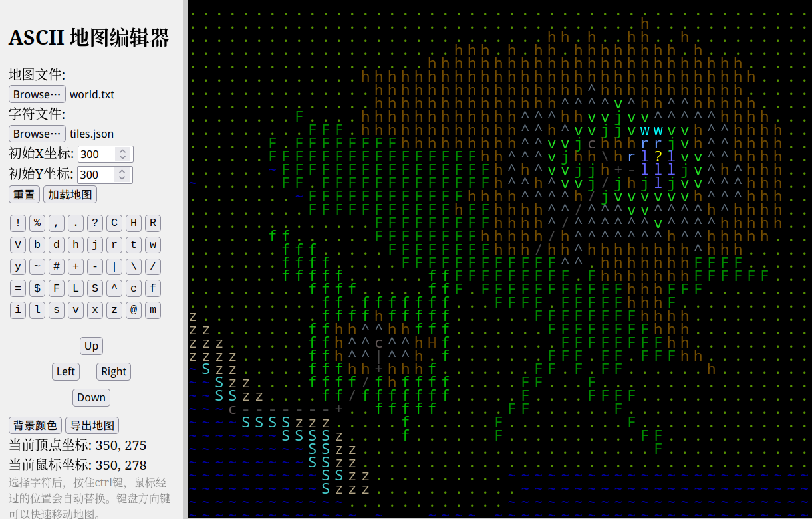

# ASCII 地图编辑器(ASCII Map Editor)

一个简单的创建和编辑 ASCII 地图的工具。

## 使用方法

- 打开页面后点击“加载地图”即可预览和编辑预设地图，方便测试。
- 选择地图的文本文件以及地图字符设定数据后点击加载地图按钮，即可加载地图。
- 点击导出地图可以讲修改后的地图保存为文本文件。

## 编辑操作

- 编辑地图前需要点击字符按钮组中的按钮选择需要编辑的字符。
- 单字修改：鼠标左键点击地图区域就可以修改对应的字符。
- 批量修改：按住 Ctrl 键，鼠标在地图区域移动，即可自动修改字符。
- 选区修改：按住 Shift 键，鼠标左键点击地图区域拖动，即可选取一个区域，批量替换选区内的字符。

## 移动地图

- 键盘方向键可以以10格为单位移动地图。
- 鼠标滚轮可以上下移动地图。
- 侧边栏的方向移动按钮可以以1格为单位移动地图。
- 按住 Alt 键，鼠标左键点击地图区域拖动，即可平移地图。

## Demo

[ASCII Map Editor Demo](https://zither.github.io/ascii-map-editor/)