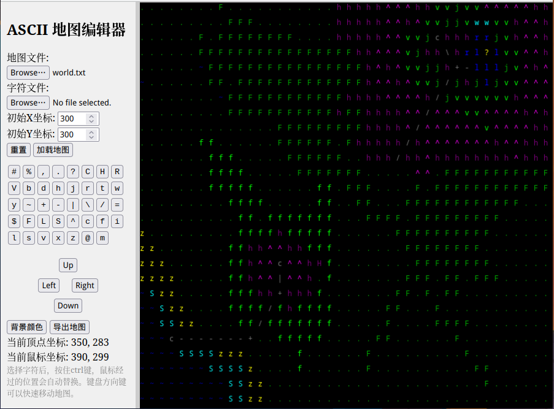

# ASCII Map Editor

A simple tool for creating and editing ASCII maps.

## Usage

- After opening the page, click "Load Map" to preview and edit the preset map for easy testing.
- Select the map text file and the map character settings data, then click the "Load Map" button to load the map.
- Click "Export Map" to save the modified map as a text file.

## Editing Operations

- Before editing the map, click the buttons in the character button group to select the character you want to edit.
- Single character modification: Left-click on the map area to modify the corresponding character.
- Batch modification: Hold down the Ctrl key and move the mouse over the map area to automatically modify characters.
- Selection modification: Hold down the Shift key, left-click on the map area and drag to select an area, then replace the characters within the selected area in bulk.

## Moving the Map

- The arrow keys on the keyboard can move the map in 10-grid increments.
- The mouse wheel can scroll the map up and down.
- The directional movement buttons on the sidebar can move the map in 1-grid increments.
- Hold down the Alt key, left-click on the map area and drag to pan the map.

## Demo

[ASCII Map Editor Demo](https://zither.github.io/ascii-map-editor/)
